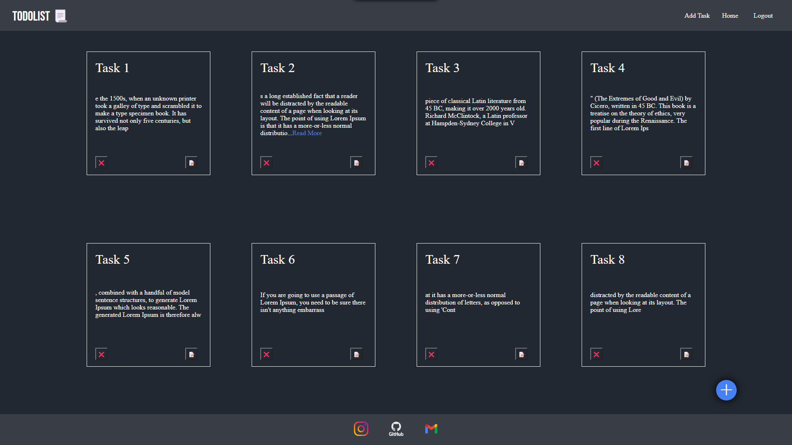

# Todo List Web Application

## Description

I've created a simple Todo List web application using Express, HTML, CSS, and MongoDB. This application allows users to manage their tasks and keep track of their to-do items.

## Features

- Add new tasks to the list.
- Mark tasks as completed.
- Delete tasks from the list.
- Store tasks in a MongoDB database.

## Technologies Used

- **Express:** Used for building the web server.
- **HTML:** For structuring the content of the web pages.
- **CSS:** Styling to enhance the visual appeal.
- **MongoDB:** A NoSQL database for storing task data.

## How to Use

1. Clone this repository:

    ```bash
    git clone https://github.com/roshan21k/todolist2.0/
    ```

2. Install dependencies:

    ```bash
    npm install
    ```

3. Start the Express server:

    ```bash
    npm start
    ```

4. Open your web browser and navigate to [http://localhost:3000](http://localhost:3000).

5. Start managing your tasks with the Todo List application.

Feel free to explore and use the Todo List web application!


## Screenshots



